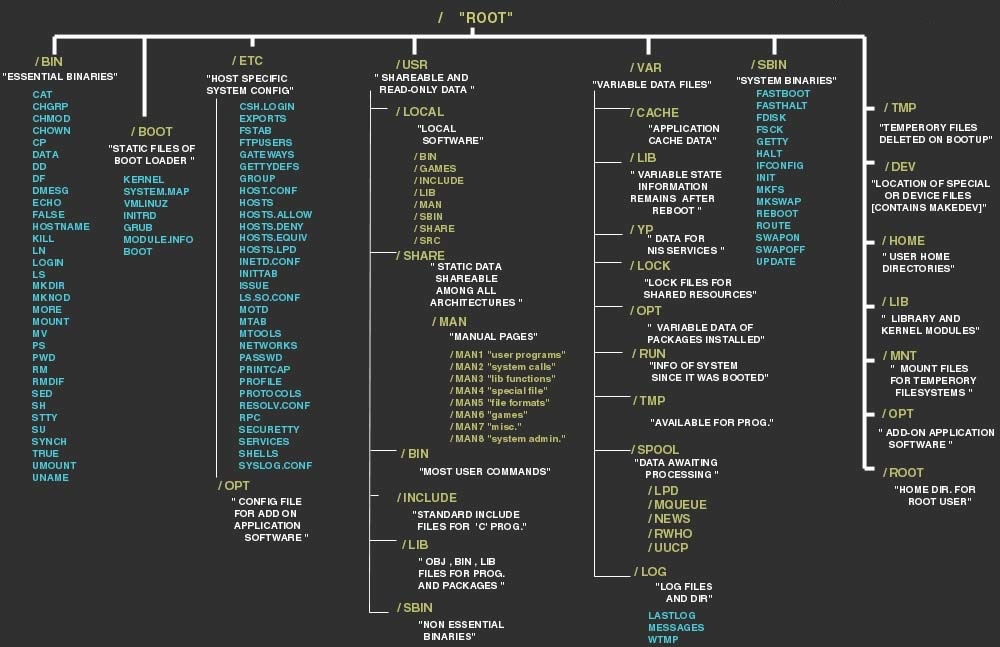

# Mocking Filesystem, File and FileInfo in Golang unit tests

## Table of content
  * [Abstract your code and make it testable](#abstract-your-code-and-make-it-testable)
  * [Write unit tests](#write-unit-tests)
    + [Define the mock filesystem](#define-the-mock-filesystem)

---

As a beginner, I found it difficult to write unit tests in GoLang for anything that use actual production resources, like filesystems, APIs, or databases. In this post, I put together my findings in the hope I will save you some time.

I will show you how to abstract calls to functions using the filesystem through the Go `os` core library, which (at least up to Go version 1.19) is not particularly test-friendly. We will also see how to define unit tests on the relative mock functions.

Note that the concepts and strategies used here apply to other scenarios:

1. Abstract the actual callsites in the functions you want to test using interfaces;
2. Define an implementation of those interfaces wrapping the “actual” calls (OS, APIs, DBs, …);
3. Write mock implementation for those interfaces not using the actual calls, and use them in your testing.

The code I am using below is taken from a project I am working on [here](https://github.com/dguerri/dockerfuse).

## Abstract your code and make it testable

Define interfaces to abstract filesystem operations (from [Andrew Gerrand's 10 things you (probably) don't know about Go](https://go.dev/talks/2012/10things.slide#8)):

```go
import (
	"io"
	"os"
)

type fileSystem interface { // Just an example, add all the functions you need
	Lstat(name string) (os.FileInfo, error)
	OpenFile(name string, flag int, perm os.FileMode) (file, error)
	ReadDir(name string) ([]os.DirEntry, error)
	Readlink(name string) (string, error)
	Remove(name string) error
}

type file interface { // Just an example, add all the functions you need
	Fd() uintptr
	io.Closer
	io.ReaderAt
	io.Seeker
	io.WriterAt
	Stat() (os.FileInfo, error)
	Sync() error
}
```

For normal filesystem operations, in the same package, define wrappers as follows:

```go
// osFS implements fileSystem using the local disk
type osFS struct{}

func (*osFS) Lstat(n string) (os.FileInfo, error)                   { return os.Lstat(n) }
func (*osFS) ReadDir(n string) ([]os.DirEntry, error)               { return os.ReadDir(n) }
func (*osFS) Readlink(n string) (string, error)                     { return os.Readlink(n) }
func (*osFS) OpenFile(n string, f int, p os.FileMode) (file, error) { return os.OpenFile(n, f, p) }
func (*osFS) Remove(n string) error                                 { return os.Remove(n) }
```

And create a global variable holding the object used to perform filesystem operations.

The default value for this variable is the wrapper I defined before.

```go
var dfFS fileSystem = &osFS{}
```

In your code, replace every `os.` call with the correspondent method of dfFS. For instance, this function:

```go
func (fso *DockerFuseFSOps) Unlink(request rpc_common.UnlinkRequest, reply *rpc_common.UnlinkReply) error {
	log.Printf("Unlink called: %v", request)

	err := os.Remove(request.FullPath)
	if err != nil {
		return rpc_common.ErrnoToRPCErrorString(err)
	}
	return nil
}
```

becomes:

```go
func (fso *DockerFuseFSOps) Unlink(request rpc_common.UnlinkRequest, reply *rpc_common.UnlinkReply) error {
	log.Printf("Unlink called: %v", request)

	err := dfFS.Remove(request.FullPath)
	if err != nil {
		return rpc_common.ErrnoToRPCErrorString(err)
	}
	return nil
}
```

Note that in this case, we just replaced `os` with `dfFS`.

## Write unit tests

In this post, I am using `stretchr/testify` to write unit tests. This is not required, but will allow you to easily mock functions and tests expectations like function calls (or absence of calls).

Describing how to use `testify` is outside the scope for this post, see the [GitHub page](https://github.com/stretchr/testify) for more information and documentation.

In case you would rather not use `testify`, you can define your own mock filesystem similarly to what I do below, but adding your logic to record calls or return appropriate values.

### Define the mock filesystem

The mock filesystem replaces the “concrete” implementation I provided before by defining all the functions specified in the `fileSystem` interface.

```go
// mockFS implements mock fileSystem for testing
type mockFS struct{ mock.Mock }

func (o *mockFS) Remove(n string) error { args := o.Called(n); return args.Error(0) }
func (o *mockFS) Lstat(n string) (fs.FileInfo, error) { ... }
func (o *mockFS) ReadDir(n string) ([]fs.DirEntry, error) { ... }
func (o *mockFS) Readlink(n string) (string, error) { ... }
func (o *mockFS) OpenFile(n string, f int, p os.FileMode) (file, error) { ... }
```

In each test, instantiate the mock filesystem and assign it to the `dfFS` global variable of your package. This way, every call to methods of `dfFS` will use a correspondent mock implementation. For instance:

```go
func TestWhatever(t *testing.T) {
	// *** Setup
	mFS := new(mockFS)
	dfFS = mFS
...
```

With testify, you need now to register the expected calls to internal functions, then call the function you want to test. Finally, you assert the expectations.

A complete example for the `Unlink()` function above:

```go
func TestUnlink(t *testing.T) {
	// *** Setup
	var (
		mFS   mockFS
		reply rpc_common.UnlinkReply
		err   error
	)
	dfFS = &mFS // Set mock filesystem
	dfFSOps := NewDockerFuseFSOps() // The object we want to test Unlink() method

	// *** Testing error on Remove
	mFS = mockFS{}
	mFS.On("Remove", "/test/error_on_openfile").Return(syscall.ENOENT)

	reply = rpc_common.UnlinkReply{}
	err = dfFSOps.Unlink(rpc_common.UnlinkRequest{FullPath: "/test/error_on_openfile"}, &reply)

	assert.Equal(t, rpc_common.UnlinkReply{}, reply)
	if assert.Error(t, err) {
		assert.Equal(t, fmt.Errorf("errno: ENOENT"), err)
	}
	mFS.AssertExpectations(t)

	// *** Testing happy path
	mFS = mockFS{}
	mFS.On("Remove", "/test/happy_path").Return(nil)

	reply = rpc_common.UnlinkReply{}
	err = dfFSOps.Unlink(rpc_common.UnlinkRequest{FullPath: "/test/happy_path"}, &reply)

	assert.Equal(t, rpc_common.UnlinkReply{}, reply)
	assert.NoError(t, err)
	mFS.AssertExpectations(t)
}
```

Here is an example mocking both a filesystem function and the `os.File` and `os.FileInfo` objects.

To do so, the mock implementation of `Open()` returns a mock file (i.e. `mockFile`), which is the implementation of the `file` interface we define earlier.

The mock file implements `Stat()` which returns a mock `os.FileInfo` object, namely `mockFileInfo`. `mockFileInfo` implements `os.FileInfo` interface, so it can be used transparently in the code that we are testing.

```go
func TestOpen(t *testing.T) {
	// *** Setup
	var (
		mFS   mockFS
		mFI   mockFileInfo
		mFile mockFile
		reply rpc_common.OpenReply
		err   error
	)
	dfFS = &mFS // Set mock filesystem
	dfFSOps := NewDockerFuseFSOps()

	// *** Testing Open on a regular existing file
	mFS = mockFS{}
	mFile = mockFile{}
	mFI = mockFileInfo{}
	mFI.On("Sys").Return(&syscall.Stat_t{Mode: 0660, Nlink: 2, ...})
	mFile.On("Fd").Return(uintptr(29))
	mFile.On("Stat").Return(mFI, nil)
	mFS.On("OpenFile", "/test/openfile_reg", syscall.O_RDWR, fs.FileMode(0640)).Return(mFile, nil)
	mFS.On("Readlink", "/test/openfile_reg").Return("", nil)

	reply = rpc_common.OpenReply{}
	err = dfFSOps.Open(rpc_common.OpenRequest{FullPath: "/test/openfile_reg", ...}, &reply)

	assert.Equal(t, rpc_common.OpenReply{FD: 29, StatReply: rpc_common.StatReply{Mode: 0660, Nlink: 2, ...}, reply)
	assert.NoError(t, err)
	mFI.AssertExpectations(t)
	mFile.AssertExpectations(t)
	mFS.AssertExpectations(t)
...
```

# That's all

Thanks for reading


